```mermaid
graph TD
    subgraph Zone1["Zone 1: Voter (Untrusted Device)"]
        V["Voter"] -->|"1. Auth (Aadhaar/OTP)"| Kiosk["Voting App"]
        Kiosk -->|"2. Create Ballot (v)"| Enc["Encryption Module"]
        Enc -->|"3. Encrypt: E(v, r)"| C["Ciphertext C"]
        Enc -->|"4. ZKP: Proof that v in {0,1}"| ZKP["ZKP Proof π"]
    end

    subgraph Zone2["Zone 2: Election Server (Public Helper)"]
        C & ZKP -->|"5. Submit via API"| API["Flask Gateway"]
        API -->|"6. Validate ZKP (Verify π)"| Val{"Valid?"}
        Val -->|Yes| Ledger["Merkle Tree Log"]
        Val -->|No| Reject["Reject Vote"]
        Ledger -->|"7. Return Receipt"| V
    end

    subgraph Zone3["Zone 3: The Trustees (Privacy Guardians)"]
        Ledger -->|"8. Homomorphic Sum"| Tally["Σ C_i"]
        Tally -->|"9. Partial Decryption"| T1["Trustee 1"]
        Tally -->|"10. Partial Decryption"| T2["Trustee 2"]
        T1 & T2 -->|"11. Combine Shares"| Final["Final Plaintext Result"]
    end
```

# 🇮� Secure Homomorphic Election System

> **Next-Generation E-Voting for Indian Democracy: Verifiable, Private, and Secure.**

    

---

## 📖 Table of Contents
1. [Executive Summary](#-executive-summary)
2. [Indian Election Context](#-context-indian-elections)
3. [System Architecture](#-system-architecture)
4. [Cryptographic Core](#-cryptographic-core-the-math)
5. [Election Lifecycle Protocol](#-election-lifecycle-protocol)
6. [Threat Model & Security](#-threat-model--security-guarantees)
7. [Installation & Usage](#-installation--usage)
8. [Project Structure](#-project-structure)

---

## 🚀 Executive Summary

This project implements a **cryptographically secure e-voting system** designed to solve the "Remote Voting" problem. It allows voters (e.g., soldiers, migrant workers) to cast votes from untrusted devices while guaranteeing:

1.  **Privacy (Confidentiality):** The server *never* sees the raw vote. It only sees encrypted data.
2.  **Integrity (Correctness):** The final tally is mathematically proven to be the sum of all valid votes.
3.  **Verifiability:** Every voter gets a receipt (Merkle Proof) proving their vote is in the final count.

We utilize **Paillier Homomorphic Encryption** for privacy-preserving tallying and **Zero-Knowledge Proofs (ZKPs)** to prevent fraud.

---

## 🇮🇳 Context: Indian Elections

India has over **94.5 Crore (945 Million)** registered voters. While EVMs (Electronic Voting Machines) are robust for in-person voting, **remote voting** remains a challenge.

### The Problem: Migrant & Service Voters
*   **Service Voters (Armed Forces):** Currently use **ETPBS** (Electronically Transmitted Postal Ballot System). They download a ballot, mark it, and **mail it physically**. This is slow, prone to postal delays, and lacks instant confirmation.
*   **Migrant Workers:** Millions of incomplete votes occur because workers cannot travel back to their home constituency to vote.

### Our Solution
This system replaces the physical mailing of ballots with a **Homomorphic Submission**.

| Feature | Current ETPBS / Postal | Secure Homomorphic Booking |
| :--- | :--- | :--- |
| **Submission** | Physical Post (Speed Post) | Instant Encrypted Upload |
| **Privacy** | Postman/Counting Agent sees the ballot paper. | **Mathematically Private**: No human ever sees the specific vote. |
| **Trust Model** | Trust the postal system & counting staff. | **Trust the Math**: Publicly verifiable proof (ZKPs). |
| **Speed** | Weeks (Counting happens last). | **Instant**: Results available seconds after polls close. |

---

## 🏗 System Architecture

The system is divided into three trust zones: **User (Untrusted)**, **Server (Semi-Trusted)**, and **Trustees (Trusted Core)**.



### Components
1.  **Voting Kiosk (Frontend)**: Handles user interaction, key retrieval, and **client-side encryption**.
2.  **Bulletin Board (Database)**: A public ledger (Merkle Tree) where all encrypted votes are posted. Anyone can audit this.
3.  **Tally Server**: Aggregates the ciphertexts. It *cannot* decrypt individual votes.
4.  **Trustee Nodes**: Holders of the private key shares. They only decrypt the *final aggregated result*.

---

## 🧮 Cryptographic Core (The Math)

The system security relies on two major primitives.

### 1. Paillier Homomorphic Encryption
Allows operations on encrypted data without decrypting it.

*   **Key Generation:**
    *   Let $n = p \cdot q$ where $p, q$ are large primes.
    *   Public Key $pk = (n, g)$.
    *   Private Key $sk = (p, q)$.
*   **Encryption:** To encrypt a vote $m \in \{0, 1\}$:
    $$c = g^m \cdot r^n \mod n^2$$
    (where $r$ is a random blinder).
*   **Homomorphic Addition:**
    Multiplying two ciphertexts equals the encryption of their sum:
    $$c_1 \cdot c_2 = E(m_1) \cdot E(m_2) = g^{m_1} r_1^n \cdot g^{m_2} r_2^n = g^{m_1+m_2} (r_1 r_2)^n = E(m_1 + m_2)$$
*   **Significance:** We can multiply all encrypted ballots to get $E(Total\_Votes)$ without ever knowing who voted for whom.

### 2. Disjunctive Chaum-Pedersen ZKP (1-out-of-2 Proof)
Since the server blindly sums votes, a malicious voter could encrypt "100" instead of "1".
To prevent this, the voter must provide a **Zero-Knowledge Proof** ($\pi$) asserting:
> "I know the plaintext of $C$, and it is either 0 OR 1."

Use a "Real vs Simulation" technique:
*   If $v=1$, user *simulates* the proof for $v=0$ and *generates* real proof for $v=1$.
*   If $v=0$, user *generates* real proof for $v=0$ and *simulates* proof for $v=1$.
*   The verifier checks both; if they check out, the vote is valid (0 or 1).

---

## 🔄 Election Lifecycle Protocol

### Phase 1: Key Ceremony 🗝️
1.  The Election Commission (ECI) generates a Master Key Pair $(PK, SK)$.
2.  **Shamir's Secret Sharing**: $SK$ is split into $n$ shares ($s_1, s_2, \dots$).
3.  Shares are distributed to Trustees (e.g., Chief Justice, CEC, Opposition Leader).
4.  **$SK$ is destroyed.** Only fragments exist.

### Phase 2: Voting 🗳️
1.  **Login:** Voter authenticates (simulated Aadhaar/OTP).
2.  **Ballot Formulation:**
    *   User selects candidate $X$.
    *   Vector created: $V = [1, 0, 0, \dots]$ for Candidates $[A, B, C, \dots]$.
3.  **Encryption:** Each element of the vector is Paillier Encrypted.
4.  **Proof Gen:** ZKPs generated for each element.
5.  **Submission:** Encrypted Ballot + ZKPs sent to server.
6.  **Receipt:** Voter receives specific hash index (Merkle path).

### Phase 3: Tallying 📊
1.  Election closes.
2.  Server computes Product of all ciphertexts for Candidate A:
    $$C_{final\_A} = \prod C_{i, A} \mod n^2$$
3.  $C_{final\_A}$ is sent to Trustees.
4.  Trustees define a threshold $t$ (e.g., 2 out of 3).
5.  Trustees use their shares $s_i$ to partially decrypt.
6.  Shares combined to reveal $Total\_Votes_A$.

---

## 🛡 Threat Model & Security Guarantees

| Threat Vector | Defense Mechanism |
| :--- | :--- |
| **Server Admin Snooping** | **Encryption:** Admin only sees random integers ($c$). Without the private key, data is useless. |
| **Database Leak** | **Ciphertext Security:** Leaked DB contains no plaintext votes, only encrypted blobs. |
| **Ballot Stuffing** | **ZKP + Auth:** Invalid votes (e.g., "50 votes") fail ZKP verification. Unauthenticated votes blocked by API. |
| **Vote Modification** | **Merkle Tree:** If the server changes a past vote, the Merkle Root changes. The voter's receipt would no longer verify against the new root. |
| **Key Theft** | **Secret Sharing:** An attacker must physically compromise multiple high-profile trustees to reconstruct the key. |
| **Coercion** | **Future Work:** Currently, a coercer standing behind the voter *can* see the screen. Possible fix: "Panic Password" that casts a fake vote. |

---

## � Installation & Usage

### Prerequisites
*   Python 3.8+
*   Pip
*   (Optional) Virtualenv

### Step 1: Clone
```bash
git clone https://github.com/your-username/secure_voting_system.git
cd secure_voting_system
```

### Step 2: Setup Environment
```bash
python3 -m venv .venv
source .venv/bin/activate  # Windows: .venv\Scripts\activate
pip install -r requirements.txt
```

### Step 3: Initialize System
This script sets up the database, generates election keys, and prepares the Mock Voter Roll.
```bash
# This happens automatically on first run of app.py, or force via:
python scripts/demo.py --init-only
```

### Step 4: Run Server
```bash
cd backend
python app.py
```
> Access the UI at: `https://localhost:5001` (Accept the self-signed cert warning)

---

## 📂 Project Structure

```bash
secure_voting_system/
├── backend/
│   ├── app.py                 # 🚀 Main Entry Point (Flask)
│   ├── secure_voting.db       # 📦 SQLite Database (Ledger)
│   ├── src/
│   │   ├── voting.py          # 🗳️ Ballot Logic (Encrypt/Decrypt)
│   │   ├── zkp.py             # 🛡️ Zero Knowledge Proofs
│   │   ├── tally.py           # ➕ Homomorphic Aggregation
│   │   ├── sss.py             # 🧩 Shamir's Secret Sharing
│   │   ├── merkle_log.py      # 📒 Audit Log
│   │   ├── paillier.py        # 🔢 Core Math Library
│   │   └── db.py              # 💾 DB Connectors
│   └── templates/             # 🎨 UI (HTML/Tailwind/CSS)
└── scripts/                   # 🛠️ Utility Scripts
    └── demo.py                # Command-line Demo
```

---

## � Future Roadmap (Enhancements)

*   **Verified Mixnets:** To support complex ballots (ranking) where sum-homomorphism isn't enough.
*   **Blockchain Integration:** Move the Merkle Log to a public blockchain (Ethereum/Polygon) for true censorship resistance.
*   **Biometric Hardware:** Integration with Aadhaar Biometric devices for kiosk authentication.
