# Secure Homomorphic Election System: A Comprehensive Technical Treatise

**A Cryptographically Verifiable E-Voting Architecture for Indian Democracy**

---

## Abstract

This document presents a comprehensive implementation of a **cryptographically secure electronic voting system** designed to address the fundamental challenges of remote voting in large-scale democratic elections. The system leverages **Paillier Homomorphic Encryption**, **Zero-Knowledge Proofs (ZKPs)**, **Shamir's Secret Sharing (SSS)**, and **Merkle Tree-based audit logs** to provide end-to-end verifiability while maintaining ballot secrecy.

The architecture is specifically contextualized for the **Indian electoral system**, targeting service voters (armed forces, government officials posted abroad) and migrant workers who cannot physically access polling stations in their registered constituencies.

**Key Contributions:**
- Privacy-preserving vote tallying without individual ballot decryption
- Cryptographic proofs preventing ballot stuffing and invalid votes
- Distributed trust model eliminating single points of failure
- Publicly auditable bulletin board with cryptographic receipts

---

## 🚀 Quick Start

### Prerequisites
- Python 3.9 or higher
- OpenSSL (for certificate generation)
- Git

### Installation (5 minutes)

```bash
# 1. Clone the repository
git clone https://github.com/yourusername/secure_voting_system.git
cd secure_voting_system

# 2. Create virtual environment
python3 -m venv .venv
source .venv/bin/activate  # On Windows: .venv\Scripts\activate

# 3. Install dependencies
pip install -r requirements.txt

# 4. Generate SSL certificates (for HTTPS)
bash scripts/generate_certs.sh

# 5. Initialize the database
cd backend
python -c "from src.db import init_db; init_db()"

# 6. Start the server
python app.py
```

### Demo Voting Flow

The server will display valid mock Aadhaar IDs on startup. Use any of these to test:

```bash
# Example voter IDs (displayed on server start):
# 123456789012, 234567890123, 345678901234, etc.

# 1. Open browser to https://localhost:5001
# 2. Enter a mock Aadhaar ID (e.g., 123456789012)
# 3. Enter the OTP displayed in server console
# 4. Cast your vote (YES/NO)
# 5. Receive cryptographic receipt with QR code
```

### Quick Demo Commands

```bash
# Run automated tests
pytest backend/ -v

# Check code quality
flake8 backend/

# Security scan
bandit -r backend/

# Close election and view results
curl https://localhost:5001/admin/close -k
# Then visit: https://localhost:5001/results
```

### Security Note
⚠️ The server uses **self-signed SSL certificates** for development. Your browser will show a security warning - this is expected. Click "Advanced" → "Proceed to localhost" to continue.

For production deployment, obtain certificates from a trusted Certificate Authority (Let's Encrypt, DigiCert, etc.).

---

## Table of Contents

1. [Quick Start](#-quick-start) ⭐
2. [Introduction & Motivation](#1-introduction--motivation)
3. [Background & Related Work](#2-background--related-work)
4. [System Model & Threat Assumptions](#3-system-model--threat-assumptions)
5. [Cryptographic Primitives](#4-cryptographic-primitives)
6. [System Architecture](#5-system-architecture)
7. [Protocol Specification](#6-protocol-specification)
8. [Security Analysis](#7-security-analysis)
9. [Implementation Details](#8-implementation-details)
10. [Indian Election Context](#9-indian-election-context)
11. [Installation & Deployment](#10-installation--deployment)
12. [Development](#development) ⭐
13. [Security Considerations](#security-considerations) ⭐
14. [Future Work & Limitations](#11-future-work--limitations)
15. [References & Further Reading](#12-references--further-reading)


---

## 1. Introduction & Motivation

### 1.1 The Democratic Voting Paradox

Democratic elections require two seemingly contradictory properties:

1. **Ballot Secrecy**: No one should know how a specific individual voted
2. **Verifiability**: Everyone should be able to verify that votes were counted correctly

Traditional paper-based systems achieve secrecy through physical anonymization (identical paper ballots mixed in a sealed box) but lack individual verifiability. Electronic systems risk privacy breaches if the database is compromised.

### 1.2 The Remote Voting Challenge

India's **Electronically Transmitted Postal Ballot System (ETPBS)** allows service voters to:
1. Download a ballot paper electronically
2. Mark their choice physically
3. Mail the ballot via Speed Post

**Critical Limitations:**
- **Latency**: Postal delays can cause votes to arrive after counting deadlines
- **Privacy Concerns**: Postal workers and counting agents handle identifiable ballots
- **No Receipt**: Voters have no cryptographic proof their vote was counted
- **Coercion Risk**: Physical ballots can be photographed under duress

### 1.3 Our Approach

We propose a **homomorphic cryptographic voting system** where:
- Votes are encrypted on the client device before transmission
- The server performs tallying on encrypted data without decryption
- Zero-knowledge proofs ensure vote validity without revealing content
- Distributed key management prevents unilateral decryption
- Merkle proofs provide individual verifiability

---

## 2. Background & Related Work

### 2.1 Evolution of E-Voting Systems

**First Generation (1960s-1990s)**: Direct Recording Electronic (DRE) machines
- **Problem**: No paper trail, "black box" trust model

**Second Generation (2000s)**: Voter-Verified Paper Audit Trail (VVPAT)
- **Problem**: Still requires physical presence

**Third Generation (2010s-Present)**: Cryptographic E-Voting
- **Examples**: Helios (2008), Scytl, Voatz
- **Our System**: Builds on Helios-style homomorphic tallying with enhanced trustee management

### 2.2 Homomorphic Encryption in Voting

**Paillier Cryptosystem (1999)** introduced by Pascal Paillier provides:
- **Additive Homomorphism**: `E(m₁) × E(m₂) = E(m₁ + m₂)`
- **Semantic Security**: Ciphertexts reveal no information about plaintexts

**Application to Voting:**
- Each vote `v ∈ {0, 1}` is encrypted as `E(v)`
- Tally computed as `∏ E(vᵢ) = E(∑ vᵢ)` (product of ciphertexts = encryption of sum)
- Only the final sum is decrypted, individual votes remain secret

### 2.3 Zero-Knowledge Proofs

**Concept**: Prove a statement is true without revealing why it's true

**In Voting Context**: Prove "I encrypted a 0 or 1" without revealing which one

**Our Implementation**: Disjunctive Chaum-Pedersen Protocol
- Prover generates two proofs (one for v=0, one for v=1)
- One proof is real, one is simulated
- Verifier cannot distinguish which is which
- But verifier knows at least one is valid → vote is binary

---

## 3. System Model & Threat Assumptions

### 3.1 Actors

| Actor | Role | Trust Level |
|-------|------|-------------|
| **Voter** | Casts encrypted ballot | Untrusted (may attempt fraud) |
| **Voting Client** | Encrypts vote, generates proofs | Trusted (voter's device) |
| **Election Server** | Collects ballots, verifies proofs | Semi-trusted (honest-but-curious) |
| **Bulletin Board** | Public ledger of encrypted votes | Append-only, publicly readable |
| **Trustees** | Hold key shares, decrypt final tally | Threshold-trusted (t-of-n honest) |

### 3.2 Adversarial Model

**Assumptions:**
1. **Honest-but-Curious Server**: May try to learn individual votes but won't modify data
2. **Malicious Voters**: May attempt to cast invalid votes (e.g., encrypt "100" instead of "1")
3. **Threshold Adversary**: Up to `t-1` trustees may collude (where `t` is threshold)
4. **Network Adversary**: Passive eavesdropper (mitigated by TLS)

**Out of Scope:**
- Client-side malware (assumes voter device integrity)
- Physical coercion (future work: panic passwords)
- Denial of Service attacks

### 3.3 Security Goals

| Property | Definition | Mechanism |
|----------|------------|-----------|
| **Ballot Secrecy** | Individual votes remain confidential | Paillier Encryption + Threshold Decryption |
| **Integrity** | Votes cannot be altered after submission | Merkle Tree + Cryptographic Hashing |
| **Eligibility** | Only registered voters can vote | Aadhaar Authentication + OTP |
| **Fairness** | No early results leak before polls close | Homomorphic tallying (no intermediate decryption) |
| **Verifiability** | Voters can verify their vote was counted | Merkle Proof Receipts |
| **Coercion Resistance** | Voters cannot prove how they voted | ⚠️ Limited (future work) |

---

## 4. Cryptographic Primitives

### 4.1 Paillier Cryptosystem

#### 4.1.1 Mathematical Foundation

**Decisional Composite Residuosity Assumption (DCRA):**
> Given `n = pq` (product of two large primes), it is computationally hard to distinguish `n`-th residues modulo `n²` from random elements in `ℤ*ₙ²`.

#### 4.1.2 Key Generation

```
Input: Security parameter λ (e.g., 2048 bits)
Output: Public key pk = (n, g), Private key sk = (λ, μ)

1. Choose two large primes p, q of bit-length λ/2
2. Compute n = p × q
3. Compute λ = lcm(p-1, q-1)
4. Select generator g ∈ ℤ*ₙ² (typically g = n + 1)
5. Compute μ = (L(g^λ mod n²))⁻¹ mod n
   where L(x) = (x - 1) / n
6. Return pk = (n, g), sk = (λ, μ)
```

**Security Parameter**: Our implementation uses 2048-bit keys (equivalent to ~112-bit security).

#### 4.1.3 Encryption

```
Input: Message m ∈ ℤₙ, Public key pk = (n, g)
Output: Ciphertext c ∈ ℤ*ₙ²

1. Select random r ∈ ℤ*ₙ (blinding factor)
2. Compute c = g^m · r^n mod n²
3. Return c
```

**Randomness Requirement**: Each encryption must use a fresh random `r`. Reusing `r` breaks semantic security.

#### 4.1.4 Decryption

```
Input: Ciphertext c ∈ ℤ*ₙ², Private key sk = (λ, μ)
Output: Message m ∈ ℤₙ

1. Compute m = L(c^λ mod n²) · μ mod n
2. Return m
```

#### 4.1.5 Homomorphic Property (Proof)

**Theorem**: `E(m₁) × E(m₂) mod n² = E(m₁ + m₂ mod n)`

**Proof:**
```
E(m₁) = g^m₁ · r₁^n mod n²
E(m₂) = g^m₂ · r₂^n mod n²

E(m₁) × E(m₂) = (g^m₁ · r₁^n) · (g^m₂ · r₂^n) mod n²
                = g^(m₁+m₂) · (r₁·r₂)^n mod n²
                = E(m₁ + m₂)  [with randomness r₃ = r₁·r₂]
```

**Application to Voting:**
```
Given encrypted votes: E(v₁), E(v₂), ..., E(vₙ)
Compute: C_total = ∏ᵢ E(vᵢ) mod n²
Then: D(C_total) = ∑ᵢ vᵢ (total vote count)
```

### 4.2 Zero-Knowledge Proofs (Disjunctive Chaum-Pedersen)

#### 4.2.1 Problem Statement

**Goal**: Prove that ciphertext `c` encrypts either 0 or 1, without revealing which.

**Naïve Approach (WRONG)**: Decrypt and show the value
- ❌ Violates ballot secrecy

**ZKP Approach**: Prove knowledge of `(m, r)` such that:
- `c = g^m · r^n mod n²` AND `m ∈ {0, 1}`

#### 4.2.2 Protocol (Sigma Protocol + OR-Composition)

**Prover Input**: `(c, m, r)` where `m ∈ {0, 1}`  
**Verifier Input**: `(c, pk)`

**Protocol Steps:**

```
1. COMMITMENT PHASE:
   - If m = 0:
       • Generate real proof for "c encrypts 0"
       • Simulate fake proof for "c encrypts 1"
   - If m = 1:
       • Simulate fake proof for "c encrypts 0"
       • Generate real proof for "c encrypts 1"

2. REAL BRANCH (assume m = 0):
   a. Choose random w ∈ ℤₙ
   b. Compute a₀ = w^n mod n²

3. FAKE BRANCH (m = 1):
   a. Choose random e₁, z₁ ∈ ℤₙ
   b. Compute a₁ = z₁^n · (c/g)^(-e₁) mod n²

4. CHALLENGE (Fiat-Shamir Heuristic):
   E = H(n || g || c || a₀ || a₁)  [hash to get non-interactive challenge]
   e₀ = E - e₁

5. RESPONSE (Real Branch):
   z₀ = w · r^(e₀) mod n

6. OUTPUT: π = (a₀, a₁, e₀, e₁, z₀, z₁)
```

**Verification:**
```
1. Check: e₀ + e₁ = H(n || g || c || a₀ || a₁)
2. Check: z₀^n = a₀ · c^(e₀) mod n²  [Branch 0: c encrypts 0]
3. Check: z₁^n = a₁ · (c/g)^(e₁) mod n²  [Branch 1: c encrypts 1]
4. Accept if all checks pass
```

**Soundness**: A cheating prover (encrypting m ∉ {0,1}) cannot produce valid proofs for both branches simultaneously.

**Zero-Knowledge**: The simulated branch is computationally indistinguishable from a real proof.

### 4.3 Shamir's Secret Sharing

#### 4.3.1 Threshold Cryptography

**Problem**: Storing the private key `sk` in one location creates a single point of failure.

**Solution**: Split `sk` into `n` shares such that:
- Any `t` shares can reconstruct `sk`
- Any `t-1` shares reveal nothing about `sk`

#### 4.3.2 Polynomial Secret Sharing

**Key Idea**: A polynomial of degree `t-1` is uniquely determined by `t` points.

**Sharing Algorithm:**
```
Input: Secret s, threshold t, number of shares n
Output: Shares (x₁, y₁), ..., (xₙ, yₙ)

1. Choose random coefficients a₁, ..., aₜ₋₁ ∈ 𝔽ₚ
2. Define polynomial: f(x) = s + a₁x + a₂x² + ... + aₜ₋₁x^(t-1)
3. For i = 1 to n:
       xᵢ = i
       yᵢ = f(xᵢ) mod p
4. Return shares: {(1, y₁), (2, y₂), ..., (n, yₙ)}
```

**Reconstruction (Lagrange Interpolation):**
```
Input: Any t shares {(xᵢ, yᵢ)}
Output: Secret s = f(0)

s = ∑ᵢ yᵢ · Lᵢ(0) mod p

where Lᵢ(0) = ∏ⱼ≠ᵢ (0 - xⱼ) / (xᵢ - xⱼ)  [Lagrange basis polynomial]
```

**Security**: Given `t-1` shares, the secret `s` is uniformly distributed over `𝔽ₚ` (information-theoretic security).

#### 4.3.3 Application to Election Keys

```
1. Generate Paillier key pair (pk, sk)
2. Serialize sk as integer s (combine p, q)
3. Split s into n shares using SSS with threshold t
4. Distribute shares to trustees:
   - Share 1 → Chief Election Commissioner
   - Share 2 → Supreme Court Observer
   - Share 3 → Opposition Party Representative
   - ...
5. DESTROY original sk
6. Publish pk to bulletin board
```

**Decryption Protocol:**
```
1. After polls close, collect t shares from trustees
2. Reconstruct sk using Lagrange interpolation
3. Decrypt final tally: m = D_sk(C_total)
4. Publish result + proof of correct decryption
5. RE-DESTROY sk (ephemeral reconstruction)
```

### 4.4 Merkle Trees (Audit Log)

#### 4.4.1 Structure

A **Merkle Tree** is a binary hash tree where:
- **Leaves**: Hashes of individual ballots `H(ballot₁), H(ballot₂), ...`
- **Internal Nodes**: Hash of concatenated children `H(left || right)`
- **Root**: Single hash representing entire dataset

```
                    Root = H(H₀₁ || H₂₃)
                   /                      \
            H₀₁ = H(H₀||H₁)          H₂₃ = H(H₂||H₃)
            /        \                /         \
        H₀=H(B₀)  H₁=H(B₁)      H₂=H(B₂)   H₃=H(B₃)
```

#### 4.4.2 Merkle Proof (Proof of Inclusion)

**Goal**: Prove ballot `Bᵢ` is in the tree without revealing other ballots.

**Proof Structure**: Path from leaf to root with sibling hashes.

**Example** (Prove B₁ is included):
```
Proof = [H₀, H₂₃]  (sibling hashes along path to root)

Verification:
1. Compute H₁ = H(B₁)
2. Compute H₀₁ = H(H₀ || H₁)  [using provided H₀]
3. Compute Root' = H(H₀₁ || H₂₃)  [using provided H₂₃]
4. Check: Root' == Published_Root
```

**Properties:**
- **Proof Size**: `O(log n)` hashes for `n` ballots
- **Verification Time**: `O(log n)` hash operations
- **Tamper Evidence**: Changing any ballot changes the root

---

## 5. System Architecture

### 5.1 Component Diagram

```mermaid
graph TD
    subgraph Zone1["Zone 1: Voter (Untrusted Device)"]
        V["Voter"] -->|"1. Auth (Aadhaar/OTP)"| Kiosk["Voting App"]
        Kiosk -->|"2. Create Ballot (v)"| Enc["Encryption Module"]
        Enc -->|"3. Encrypt: E(v, r)"| C["Ciphertext C"]
        Enc -->|"4. ZKP: Proof that v in {0,1}"| ZKP["ZKP Proof π"]
    end

    subgraph Zone2["Zone 2: Election Server (Public Helper)"]
        C & ZKP -->|"5. Submit via API"| API["Flask Gateway"]
        API -->|"6. Validate ZKP (Verify π)"| Val{"Valid?"}
        Val -->|Yes| Ledger["Merkle Tree Log"]
        Val -->|No| Reject["Reject Vote"]
        Ledger -->|"7. Return Receipt"| V
    end

    subgraph Zone3["Zone 3: The Trustees (Privacy Guardians)"]
        Ledger -->|"8. Homomorphic Sum"| Tally["Σ C_i"]
        Tally -->|"9. Partial Decryption"| T1["Trustee 1"]
        Tally -->|"10. Partial Decryption"| T2["Trustee 2"]
        T1 & T2 -->|"11. Combine Shares"| Final["Final Plaintext Result"]
    end
```



### 5.2 Data Flow Architecture

```mermaid
sequenceDiagram
    participant V as Voter
    participant C as Client App
    participant S as Server
    participant BB as Bulletin Board
    participant T as Trustees

    V->>C: Select Candidate
    C->>C: Fetch Public Key
    C->>C: Encrypt Vote: E(v, r)
    C->>C: Generate ZKP: π
    C->>S: Submit (E(v), π)
    S->>S: Verify ZKP
    alt ZKP Valid
        S->>BB: Append to Merkle Tree
        BB->>S: Merkle Proof
        S->>C: Receipt (Merkle Path)
        C->>V: Show Receipt
    else ZKP Invalid
        S->>C: Reject
    end
    
    Note over S,BB: Election Closes
    
    S->>S: Compute ∏ E(vᵢ)
    S->>T: Request Decryption
    T->>T: Combine t Shares
    T->>T: Decrypt Final Sum
    T->>BB: Publish Result
```



### 5.3 Trust Boundaries

| Zone | Components | Trust Assumption | Attack Surface |
|------|------------|------------------|----------------|
| **Client** | Browser/Mobile App, Encryption Module | Trusted by voter | Malware, Screen capture |
| **Server** | Flask API, Database, Bulletin Board | Honest-but-curious | Database breach, Admin access |
| **Network** | TLS/HTTPS | Passive eavesdropper | Traffic analysis (mitigated by encryption) |
| **Trustees** | Key Share Holders | Threshold honest (t-of-n) | Collusion, Physical theft |

---

## 6. Protocol Specification

### 6.1 Setup Phase

#### 6.1.1 Key Generation Ceremony

```python
# Pseudocode
def setup_election(num_trustees=5, threshold=3):
    # 1. Generate Paillier keypair
    (pk, sk) = paillier.generate_keypair(n_length=2048)
    
    # 2. Serialize private key
    sk_bytes = serialize(sk.p, sk.q)
    
    # 3. Split using Shamir's Secret Sharing
    shares = shamir_split(sk_bytes, threshold, num_trustees)
    
    # 4. Distribute shares securely
    for i, share in enumerate(shares):
        encrypt_and_send_to_trustee(i, share)
    
    # 5. DESTROY sk
    secure_delete(sk)
    
    # 6. Publish pk to bulletin board
    bulletin_board.publish(pk)
    
    return pk
```

**Security Considerations:**
- Key generation must occur in a secure, audited environment
- Trustee identities must be publicly known and diverse
- Share distribution uses asymmetric encryption (trustee public keys)

#### 6.1.2 Voter Registration

```python
def register_voter(aadhaar_number, constituency):
    # 1. Verify Aadhaar authenticity (API call to UIDAI)
    if not uidai.verify(aadhaar_number):
        return ERROR
    
    # 2. Check eligibility (age, citizenship)
    voter_data = eci_database.lookup(aadhaar_number)
    if voter_data.age < 18:
        return ERROR
    
    # 3. Assign to constituency
    voter_data.constituency = constituency
    
    # 4. Generate voter credential
    credential = hmac(aadhaar_number, election_secret)
    
    # 5. Store in database (hashed Aadhaar for privacy)
    db.store(hash(aadhaar_number), credential, constituency)
    
    return credential
```

### 6.2 Voting Phase

#### 6.2.1 Ballot Creation (Client-Side)

```python
def cast_vote(candidate_id, voter_credential):
    # 1. Authenticate voter
    session = authenticate(voter_credential)
    
    # 2. Fetch public key
    pk = fetch_public_key()
    
    # 3. Encode vote as integer
    vote_vector = [0] * num_candidates
    vote_vector[candidate_id] = 1  # One-hot encoding
    
    # 4. Encrypt each element
    encrypted_votes = []
    proofs = []
    for v in vote_vector:
        r = generate_random_blinding_factor()
        c = paillier_encrypt(pk, v, r)
        π = generate_zkp(pk, c, v, r)
        encrypted_votes.append(c)
        proofs.append(π)
    
    # 5. Create ballot structure
    ballot = {
        "ballot_id": uuid4(),
        "timestamp": current_time(),
        "ciphertexts": encrypted_votes,
        "proofs": proofs,
        "voter_credential_hash": hash(voter_credential)
    }
    
    # 6. Submit to server
    receipt = submit_ballot(ballot)
    
    # 7. Display Merkle proof to voter
    display_receipt(receipt)
    
    return receipt
```

#### 6.2.2 Ballot Verification (Server-Side)

```python
def process_ballot(ballot):
    # 1. Check voter eligibility
    if db.has_voted(ballot.voter_credential_hash):
        return REJECT("Already voted")
    
    # 2. Verify ZKPs
    pk = load_public_key()
    for (c, π) in zip(ballot.ciphertexts, ballot.proofs):
        if not verify_zkp(pk, c, π):
            return REJECT("Invalid proof")
    
    # 3. Verify exactly one vote cast (sum of plaintexts = 1)
    # This requires a range proof or sum proof (advanced)
    # Simplified: Trust ZKP for now
    
    # 4. Add to Merkle tree
    ballot_hash = hash(ballot)
    merkle_tree.add_leaf(ballot_hash)
    merkle_proof = merkle_tree.get_proof(ballot_hash)
    
    # 5. Store in database
    db.store_ballot(ballot)
    db.mark_voted(ballot.voter_credential_hash)
    
    # 6. Return receipt
    return {
        "ballot_id": ballot.ballot_id,
        "merkle_proof": merkle_proof,
        "merkle_root": merkle_tree.get_root()
    }
```

### 6.3 Tallying Phase

#### 6.3.1 Homomorphic Aggregation

```python
def compute_tally():
    # 1. Retrieve all ballots
    ballots = db.get_all_ballots()
    
    # 2. Initialize accumulators (one per candidate)
    pk = load_public_key()
    tallies = [paillier.EncryptedNumber(pk, 1, 0)] * num_candidates
    
    # 3. Homomorphically add votes
    for ballot in ballots:
        for i, c in enumerate(ballot.ciphertexts):
            tallies[i] = tallies[i] * c  # Multiplication in ciphertext space = addition in plaintext
    
    # 4. Publish encrypted tallies
    bulletin_board.publish(tallies)
    
    return tallies
```

#### 6.3.2 Threshold Decryption

```python
def decrypt_results(encrypted_tallies, trustee_shares):
    # 1. Verify threshold met
    if len(trustee_shares) < threshold:
        return ERROR("Insufficient trustees")
    
    # 2. Reconstruct private key
    sk = shamir_reconstruct(trustee_shares)
    
    # 3. Decrypt each tally
    results = []
    for c in encrypted_tallies:
        plaintext = paillier_decrypt(sk, c)
        results.append(plaintext)
    
    # 4. Generate proof of correct decryption (advanced: Chaum-Pedersen)
    # Simplified: Publish sk temporarily for public verification
    
    # 5. DESTROY reconstructed sk
    secure_delete(sk)
    
    # 6. Publish results
    bulletin_board.publish(results)
    
    return results
```

### 6.4 Verification Phase

#### 6.4.1 Individual Verification

```python
def verify_my_vote(ballot_id, merkle_proof, published_root):
    # 1. Retrieve my ballot from bulletin board
    ballot = bulletin_board.get_ballot(ballot_id)
    
    # 2. Recompute ballot hash
    ballot_hash = hash(ballot)
    
    # 3. Verify Merkle proof
    computed_root = merkle_verify(ballot_hash, merkle_proof)
    
    # 4. Check against published root
    if computed_root == published_root:
        return VERIFIED
    else:
        return FRAUD_DETECTED
```

#### 6.4.2 Universal Verification

```python
def verify_election():
    # 1. Download entire bulletin board
    ballots = bulletin_board.get_all_ballots()
    
    # 2. Verify all ZKPs
    pk = load_public_key()
    for ballot in ballots:
        for (c, π) in zip(ballot.ciphertexts, ballot.proofs):
            assert verify_zkp(pk, c, π), "Invalid ZKP detected"
    
    # 3. Recompute homomorphic tally
    recomputed_tallies = compute_tally()
    published_tallies = bulletin_board.get_tallies()
    assert recomputed_tallies == published_tallies, "Tally mismatch"
    
    # 4. Verify decryption (if proof provided)
    # Advanced: Check Chaum-Pedersen decryption proof
    
    return ALL_VERIFIED
```

---

## 7. Security Analysis

### 7.1 Threat Model Analysis

| Attack Vector | Threat | Mitigation | Residual Risk |
|---------------|--------|------------|---------------|
| **Server Database Breach** | Attacker steals encrypted votes | Paillier encryption (2048-bit) | Quantum computers (future) |
| **Malicious Voter** | Cast 100 votes as "1" | ZKP verification rejects invalid proofs | None (cryptographically prevented) |
| **Trustee Collusion** | t-1 trustees try to decrypt early | SSS threshold prevents reconstruction | If ≥t trustees collude, system breaks |
| **Ballot Modification** | Server changes a vote after submission | Merkle tree + voter receipts detect tampering | None (publicly auditable) |
| **Replay Attack** | Resubmit old ballot | Timestamp + nonce + voter credential check | None |
| **Coercion** | Attacker forces voter to prove vote | ⚠️ No mechanism (future: panic passwords) | **HIGH** |

### 7.2 Formal Security Properties

#### 7.2.1 Ballot Secrecy (IND-CPA Security)

**Theorem**: Under the DCRA assumption, the system provides ballot secrecy.

**Proof Sketch**:
1. Each vote `v` is encrypted using Paillier with fresh randomness `r`
2. Paillier is IND-CPA secure under DCRA
3. Server sees only `c = g^v · r^n mod n²`
4. Without `sk`, distinguishing `E(0)` from `E(1)` is equivalent to solving DCRA
5. Therefore, individual votes are computationally hidden

**Caveat**: If the same `r` is reused, security breaks (our implementation enforces fresh randomness).

#### 7.2.2 Integrity (Existential Unforgeability)

**Theorem**: A malicious voter cannot cast an invalid vote (v ∉ {0,1}) that passes verification.

**Proof Sketch**:
1. ZKP verification checks both branches (v=0 and v=1)
2. Soundness of Sigma protocol ensures prover knows valid witness
3. Fiat-Shamir heuristic (random oracle model) prevents adaptive attacks
4. Therefore, only valid votes are accepted

#### 7.2.3 Verifiability (Publicly Auditable)

**Theorem**: Any observer can verify the election result is correct.

**Verification Steps**:
1. Download all ballots from bulletin board
2. Verify each ZKP independently
3. Recompute homomorphic tally: `∏ cᵢ`
4. Check published encrypted tally matches
5. Verify decryption proof (trustees must prove correct decryption)

**Merkle Tree Property**: Any tampering with a ballot changes the root hash, detectable by voters with receipts.

---

## 8. Implementation Details

### 8.1 Technology Stack

| Layer | Technology | Justification |
|-------|------------|---------------|
| **Backend** | Python 3.9 + Flask | Rapid prototyping, rich crypto libraries |
| **Cryptography** | `python-paillier` (phe) | Mature Paillier implementation |
| **Database** | SQLite | Lightweight, ACID-compliant |
| **Frontend** | HTML5 + Vanilla JS | No framework dependencies, transparent code |
| **Transport** | HTTPS (TLS 1.3) | Encrypted communication |

### 8.2 Project Structure

```
secure_voting_system/
├── backend/
│   ├── app.py                    # Flask application entry point
│   ├── src/
│   │   ├── voting.py             # Ballot encryption logic
│   │   ├── zkp.py                # Zero-knowledge proof implementation
│   │   ├── tally.py              # Homomorphic tallying
│   │   ├── sss.py                # Shamir's Secret Sharing
│   │   ├── hybrid_sss.py         # Encrypted key storage + SSS
│   │   ├── merkle_log.py         # Merkle tree implementation
│   │   ├── keygen.py             # Key generation utilities
│   │   ├── hsm.py                # Hardware Security Module simulation
│   │   ├── bulletin_board.py     # Public ledger interface
│   │   └── db.py                 # Database operations
│   ├── templates/
│   │   ├── login.html            # Voter authentication UI
│   │   ├── vote.html             # Ballot casting interface
│   │   ├── success.html          # Receipt display
│   │   └── results.html          # Tally display
│   └── secure_voting.db          # SQLite database
├── scripts/
│   └── demo.py                   # Command-line testing utilities
├── trustee_storage/              # Trustee key shares (simulated)
└── README.md                     # This document
```

### 8.3 Key Code Modules

#### 8.3.1 Ballot Encryption ([voting.py](file:///Users/anaslari/Desktop/secure_voting_system/backend/src/voting.py))

```python
def create_ballot(vote_int, kiosk_id="kiosk-demo"):
    """
    Encrypts a vote (0 or 1) and creates a ballot object.
    """
    public_key = load_public_key()
    
    # Generate cryptographically secure randomness
    r = random.SystemRandom().randint(1, public_key.n)
    while math.gcd(r, public_key.n) != 1:  # Ensure r ∈ ℤ*ₙ
        r = random.SystemRandom().randint(1, public_key.n)
    
    # Encrypt with explicit randomness
    encrypted_vote = public_key.encrypt(vote_int, r_value=r)
    ciphertext_int = encrypted_vote.ciphertext(be_secure=False)
    
    # Generate ZKP
    prover = ZKPProver(public_key)
    zkp_proof = prover.prove_vote(ciphertext_int, vote_int, r)
    
    ballot = {
        "ballot_id": str(uuid.uuid4()),
        "timestamp": time.time(),
        "kiosk_id": kiosk_id,
        "ciphertext": str(ciphertext_int),
        "exponent": encrypted_vote.exponent,
        "proof": zkp_proof
    }
    
    return ballot
```

#### 8.3.2 ZKP Verification ([zkp.py](file:///Users/anaslari/Desktop/secure_voting_system/backend/src/zkp.py))

```python
def verify(self, ciphertext_int, proof):
    """
    Verifies the disjunctive ZKP.
    Returns True if proof is valid, False otherwise.
    """
    u = int(ciphertext_int)
    a = [int(x) for x in proof["a"]]
    e = [int(x) for x in proof["e"]]
    z = [int(x) for x in proof["z"]]
    
    # Check challenge consistency
    expected_total_e = hash_nums([self.n, self.g, u, a[0], a[1]])
    if expected_total_e != e[0] + e[1]:
        return False
    
    # Verify branch 0: u = r^n (encrypts 0)
    if pow(z[0], self.n, self.ns) != (a[0] * pow(u, e[0], self.ns)) % self.ns:
        return False
    
    # Verify branch 1: u/g = r^n (encrypts 1)
    val = (u * pow(self.g, -1, self.ns)) % self.ns
    if pow(z[1], self.n, self.ns) != (a[1] * pow(val, e[1], self.ns)) % self.ns:
        return False
    
    return True
```

#### 8.3.3 Homomorphic Tallying ([tally.py](file:///Users/anaslari/Desktop/secure_voting_system/backend/src/tally.py))

```python
def compute_tally(public_key):
    """
    Aggregates all encrypted votes homomorphically.
    """
    bb = BulletinBoard()
    ledger = bb.get_all_ballots()
    
    encrypted_ballots = []
    for entry in ledger:
        ballot = entry['ballot']
        c_int = int(ballot['ciphertext'])
        exp = int(ballot['exponent'])
        enc_vote = paillier.EncryptedNumber(public_key, c_int, exp)
        encrypted_ballots.append(enc_vote)
    
    # Sum using Python's built-in sum (leverages Paillier's __add__)
    return sum(encrypted_ballots)
```

### 8.4 Database Schema

```sql
-- Voter Registry
CREATE TABLE voters (
    aadhaar TEXT PRIMARY KEY,      -- Hashed Aadhaar (privacy)
    name TEXT NOT NULL,
    phone TEXT NOT NULL,
    has_voted BOOLEAN DEFAULT 0
);

-- Ballot Ledger (Bulletin Board)
CREATE TABLE ballots (
    id INTEGER PRIMARY KEY AUTOINCREMENT,
    ballot_id TEXT NOT NULL,       -- UUID
    ciphertext TEXT NOT NULL,      -- Encrypted vote
    proof TEXT NOT NULL,           -- ZKP (JSON serialized)
    prev_hash TEXT NOT NULL,       -- Blockchain-style chaining
    merkle_root TEXT NOT NULL,     -- Merkle root at insertion time
    timestamp REAL NOT NULL,
    kiosk_id TEXT
);
```

---

## 9. Indian Election Context

### 9.1 Current Remote Voting Mechanisms

#### 9.1.1 ETPBS (Electronically Transmitted Postal Ballot System)

**Process:**
1. Service voter registers online
2. Downloads blank ballot PDF
3. Prints, marks, and signs ballot
4. Mails via Speed Post to Returning Officer
5. Ballot counted manually on counting day

**Pain Points:**
- **Latency**: 7-14 days postal transit
- **Rejection Rate**: ~15% due to late arrival or improper attestation
- **Privacy**: Ballot envelope has voter details

#### 9.1.2 Proxy Voting (Limited)

- Introduced in 2024 for senior citizens (80+) and persons with disabilities
- Nominated proxy casts vote on behalf
- **Problem**: Coercion risk, limited scalability

### 9.2 Our System's Advantages

| Feature | ETPBS | Our System |
|---------|-------|------------|
| **Submission Time** | 7-14 days | Instant |
| **Privacy** | Envelope has voter ID | Cryptographically anonymous |
| **Verifiability** | Trust-based | Cryptographic receipt |
| **Coercion Resistance** | Low (physical ballot) | Medium (screen visible) |
| **Accessibility** | Requires printer | Any smartphone |
| **Cost** | ₹50-100 per ballot (postage) | Negligible (internet) |

### 9.3 Deployment Scenario

**Target Demographics:**
1. **Armed Forces**: 1.4 million personnel
2. **Central Police Forces**: 1 million
3. **Government Officials Abroad**: ~200,000
4. **Migrant Workers**: 50+ million (future expansion)

**Pilot Implementation:**
1. **Phase 1**: Single constituency by-election (e.g., Wayanad)
2. **Phase 2**: State assembly elections (e.g., Goa - small electorate)
3. **Phase 3**: Lok Sabha elections (service voters only)
4. **Phase 4**: Full remote voting (subject to Supreme Court approval)

### 9.4 Legal & Regulatory Considerations

**Current Legal Framework:**
- **Representation of the People Act, 1951**: Mandates secrecy and in-person voting
- **Amendment Required**: Section 60 (manner of voting) needs modification

**ECI Guidelines (Hypothetical):**
1. Voter must authenticate using Aadhaar + Biometric
2. Cryptographic receipt must be provided
3. Bulletin board must be publicly accessible
4. Trustee identities must include:
   - Chief Election Commissioner
   - Supreme Court nominee
   - Leader of Opposition
   - Two civil society representatives

**Supreme Court Precedents:**
- *PUCL v. Union of India (2013)*: Right to negative vote (NOTA)
- *Lily Thomas v. Union of India (2013)*: Transparency in electoral process
- Our system aligns with transparency requirements via public bulletin board

---

## 10. Installation & Deployment

### 10.1 System Requirements

**Minimum:**
- Python 3.8+
- 2GB RAM
- 1GB disk space

**Recommended (Production):**
- Python 3.9+
- 8GB RAM
- 50GB SSD
- Multi-core CPU (for ZKP verification parallelization)

### 10.2 Installation Steps

#### Step 1: Clone Repository
```bash
git clone https://github.com/your-org/secure_voting_system.git
cd secure_voting_system
```

#### Step 2: Create Virtual Environment
```bash
python3 -m venv .venv
source .venv/bin/activate  # Windows: .venv\Scripts\activate
```

#### Step 3: Install Dependencies
```bash
pip install -r requirements.txt
```

**Key Dependencies:**
```
Flask==2.3.0
phe==1.5.0              # Paillier Homomorphic Encryption
qrcode==7.4.2           # QR code generation for receipts
```

#### Step 4: Initialize Database & Keys
```bash
cd backend
python app.py
```

**First Run Actions:**
- Creates `secure_voting.db` with schema
- Generates 2048-bit Paillier keypair
- Splits private key into 5 shares (threshold=3)
- Seeds mock voter data

#### Step 5: Access Application
```
URL: https://localhost:5001
```

**Note**: Accept self-signed certificate warning (production should use CA-signed cert)

### 10.3 Configuration

#### Environment Variables
```bash
export ELECTION_NAME="Lok Sabha 2029"
export TRUSTEE_COUNT=5
export TRUSTEE_THRESHOLD=3
export KEY_SIZE=2048
export ENABLE_AUDIT_LOG=true
```

#### Trustee Setup
```bash
# Distribute shares to trustees
python scripts/distribute_shares.py \
  --trustee-emails "cec@eci.gov.in,sc@judiciary.in,opposition@party.in"
```

### 10.4 Production Deployment

#### Security Hardening
1. **TLS Certificate**: Obtain from Let's Encrypt or commercial CA
2. **Firewall**: Restrict port 5001 to authorized IPs
3. **Rate Limiting**: Prevent DoS attacks
   ```python
   from flask_limiter import Limiter
   limiter = Limiter(app, key_func=get_remote_address)
   
   @app.route("/vote", methods=["POST"])
   @limiter.limit("5 per minute")
   def submit_vote():
       ...
   ```

4. **Database Encryption**: Use SQLCipher for encrypted SQLite
5. **Audit Logging**: Log all API calls with timestamps

#### Scalability
- **Load Balancer**: Nginx reverse proxy
- **Database**: Migrate to PostgreSQL for concurrent writes
- **Caching**: Redis for public key caching
- **CDN**: CloudFlare for bulletin board distribution

---

## 11. Future Work & Limitations

### 11.1 Current Limitations

| Limitation | Impact | Mitigation Plan |
|------------|--------|-----------------|
| **Coercion Resistance** | Voter can be forced to show screen | Implement "panic password" (casts decoy vote) |
| **Receipt-Free Voting** | Voter can prove how they voted (receipt) | Use re-encryption mixnets (complex) |
| **Quantum Vulnerability** | Paillier breakable by Shor's algorithm | Transition to lattice-based crypto (post-quantum) |
| **Client-Side Trust** | Malware can change vote before encryption | Trusted hardware (TPM) or code attestation |
| **Scalability** | ZKP verification is CPU-intensive | GPU acceleration, zk-SNARKs |

### 11.2 Roadmap

#### Phase 1 (Current): Proof of Concept
- ✅ Paillier encryption
- ✅ Disjunctive ZKP
- ✅ Shamir's Secret Sharing
- ✅ Merkle audit log

#### Phase 2: Enhanced Security
- [ ] Threshold decryption with proofs (Chaum-Pedersen)
- [ ] Panic password mechanism
- [ ] Hardware security module (HSM) integration
- [ ] Formal verification using TLA+ or Coq

#### Phase 3: Scalability
- [ ] zk-SNARKs for constant-size proofs
- [ ] Distributed bulletin board (blockchain)
- [ ] Mobile app (iOS/Android)
- [ ] Biometric authentication (Aadhaar integration)

#### Phase 4: Advanced Features
- [ ] Ranked-choice voting (requires mixnets)
- [ ] Multi-constituency support
- [ ] Real-time result visualization
- [ ] Post-quantum cryptography (Kyber, Dilithium)

### 11.3 Research Directions

1. **Verifiable Shuffles**: Use mixnets for receipt-free voting
2. **Universal Composability**: Prove security in UC framework
3. **Blockchain Integration**: Ethereum smart contracts for bulletin board
4. **Coercion Mitigation**: Deniable encryption schemes
5. **Accessibility**: Voice-based voting for visually impaired

---

## 12. References & Further Reading

### 12.1 Foundational Papers

1. **Paillier, P. (1999)**. "Public-Key Cryptosystems Based on Composite Degree Residuosity Classes." *EUROCRYPT 1999*.
   - Original Paillier cryptosystem paper

2. **Chaum, D., & Pedersen, T. P. (1992)**. "Wallet Databases with Observers." *CRYPTO 1992*.
   - Zero-knowledge proof foundations

3. **Shamir, A. (1979)**. "How to Share a Secret." *Communications of the ACM*.
   - Threshold secret sharing

4. **Adida, B. (2008)**. "Helios: Web-based Open-Audit Voting." *USENIX Security*.
   - Practical homomorphic voting system

### 12.2 Standards & Specifications

- **IEEE 1622-2011**: Standard for Electronic Voting
- **Common Criteria**: EAL4+ certification for voting systems
- **NIST SP 800-63**: Digital Identity Guidelines

### 12.3 Indian Election Resources

- **Election Commission of India**: [eci.gov.in](https://eci.gov.in)
- **ETPBS Guidelines**: ECI Handbook for Service Voters
- **Aadhaar Authentication API**: [uidai.gov.in](https://uidai.gov.in)

### 12.4 Cryptography Libraries

- **python-paillier**: [github.com/data61/python-paillier](https://github.com/data61/python-paillier)
- **PyCryptodome**: General-purpose crypto library
- **libsodium**: Modern crypto primitives

---

---

## Development

### Setting Up Development Environment

```bash
# Install development dependencies
pip install -r requirements-dev.txt

# Run tests with coverage
pytest backend/ scripts/ -v --cov=backend --cov-report=html

# View coverage report
open htmlcov/index.html  # macOS
# or: xdg-open htmlcov/index.html  # Linux
```

### Code Quality Tools

```bash
# Format code with black
black backend/

# Sort imports
isort backend/

# Lint with flake8
flake8 backend/ --max-line-length=127

# Type checking
mypy backend/

# Security scanning
bandit -r backend/ -ll
safety check
```

### Running Tests

```bash
# Run all tests
pytest backend/ -v

# Run specific test file
pytest backend/test_app_integration.py -v

# Run with coverage
pytest --cov=backend --cov-report=term-missing

# Run integration tests
pytest scripts/test_app_integration.py -v
```

### Contributing

1. Fork the repository
2. Create a feature branch: `git checkout -b feature/amazing-feature`
3. Make your changes
4. Run tests and linting: `pytest && flake8 backend/`
5. Commit your changes: `git commit -m 'Add amazing feature'`
6. Push to the branch: `git push origin feature/amazing-feature`
7. Open a Pull Request

**Note**: All PRs must pass CI checks (tests, linting, security scans) before merging.

### Project Structure

```
secure_voting_system/
├── .github/
│   ├── workflows/
│   │   └── ci.yml              # GitHub Actions CI pipeline
│   └── dependabot.yml          # Dependency update automation
├── backend/
│   ├── app.py                  # Flask application entry point
│   ├── src/
│   │   ├── voting.py           # Ballot encryption logic
│   │   ├── zkp.py              # Zero-knowledge proofs
│   │   ├── tally.py            # Homomorphic tallying
│   │   ├── sss.py              # Shamir's Secret Sharing
│   │   ├── hybrid_sss.py       # Encrypted key storage
│   │   ├── merkle_log.py       # Merkle tree implementation
│   │   ├── bulletin_board.py   # Public ledger
│   │   └── db.py               # Database operations
│   ├── templates/              # HTML templates
│   └── static/                 # CSS, JavaScript
├── scripts/
│   ├── demo.py                 # Demo utilities
│   └── generate_certs.sh       # SSL certificate generation
├── .env.example                # Environment variable template
├── .gitignore                  # Git ignore patterns
├── requirements.txt            # Production dependencies
├── requirements-dev.txt        # Development dependencies
├── SECURITY.md                 # Security policy
└── README.md                   # This file
```

---

## Security Considerations

### For Developers

**Never Commit Secrets**
- SSL certificates, private keys, and API keys must never be committed to the repository
- Use `.env` files for local configuration (already in `.gitignore`)
- Use environment variables for production secrets

**Generate Certificates Locally**
```bash
# Generate self-signed certificates for development
bash scripts/generate_certs.sh

# For production, use Let's Encrypt or a trusted CA
certbot certonly --standalone -d yourdomain.com
```

**Secret Rotation**
If secrets are accidentally committed:
1. Immediately rotate the compromised credentials
2. Remove from git history: `git filter-branch` or BFG Repo-Cleaner
3. Force push to remote (coordinate with team)
4. Update all deployment environments

### For Deployment

**Production Checklist**
- [ ] Use strong, randomly generated Flask secret key (not `os.urandom(24)`)
- [ ] Obtain SSL certificates from trusted CA (Let's Encrypt, DigiCert)
- [ ] Enable HTTPS only (disable HTTP)
- [ ] Implement rate limiting on authentication endpoints
- [ ] Use secure session management (httponly, secure, samesite cookies)
- [ ] Enable database encryption at rest
- [ ] Set up comprehensive logging and monitoring
- [ ] Implement intrusion detection
- [ ] Regular security audits and penetration testing
- [ ] Backup trustee key shares in secure, geographically distributed locations

**Environment Variables**
```bash
# Production configuration
export FLASK_SECRET_KEY="$(openssl rand -hex 32)"
export DATABASE_PATH="/secure/path/to/production.db"
export SSL_CERT_PATH="/etc/letsencrypt/live/yourdomain/fullchain.pem"
export SSL_KEY_PATH="/etc/letsencrypt/live/yourdomain/privkey.pem"
export FLASK_ENV="production"
export FLASK_DEBUG="False"
```

**Trustee Key Management**
- Store trustee shares in Hardware Security Modules (HSMs)
- Use multi-party computation for key generation
- Implement key ceremony with witnesses
- Maintain audit logs of all key operations
- Never store complete private key in one location

### Vulnerability Reporting

If you discover a security vulnerability, please follow our [Security Policy](SECURITY.md):
- **DO NOT** open a public GitHub issue
- Email security contacts listed in SECURITY.md
- Provide detailed reproduction steps
- Allow reasonable time for patching before public disclosure

### Known Limitations

This is a **demonstration/educational project**. For production use:
- ⚠️ **Coercion Resistance**: Limited protection against vote-buying/coercion
- ⚠️ **Client Security**: Assumes voter device is not compromised
- ⚠️ **Quantum Resistance**: Paillier encryption vulnerable to quantum computers
- ⚠️ **Scalability**: Not optimized for millions of concurrent voters
- ⚠️ **Accessibility**: Limited support for voters with disabilities

**Recommended Enhancements for Production:**
- Implement receipt-free voting (e.g., JCJ/Civitas protocol)
- Add panic passwords for coercion scenarios
- Use post-quantum cryptography (lattice-based schemes)
- Implement distributed bulletin board (blockchain/consensus)
- Add comprehensive accessibility features (screen readers, voice voting)
- Professional security audit by certified firm
- Compliance with election security standards (EAC, IEEE 1622)

---

## Appendix A: Mathematical Notation


| Symbol | Meaning |
|--------|---------|
| `ℤₙ` | Integers modulo n |
| `ℤ*ₙ` | Multiplicative group modulo n (coprime to n) |
| `𝔽ₚ` | Finite field of prime order p |
| `E(m)` | Encryption of message m |
| `D(c)` | Decryption of ciphertext c |
| `H(x)` | Cryptographic hash of x |
| `a ≡ b (mod n)` | a is congruent to b modulo n |
| `gcd(a, b)` | Greatest common divisor |
| `lcm(a, b)` | Least common multiple |
| `∏` | Product (multiplication) |
| `∑` | Sum (addition) |

---

## Appendix B: Glossary

**Ballot Secrecy**: Property ensuring individual votes remain confidential.

**Bulletin Board**: Public, append-only ledger of encrypted ballots.

**Ciphertext**: Encrypted data (unreadable without decryption key).

**Homomorphic Encryption**: Encryption allowing computation on encrypted data.

**Merkle Proof**: Cryptographic proof that data is in a Merkle tree.

**Threshold Cryptography**: Cryptosystem requiring t-of-n parties to decrypt.

**Zero-Knowledge Proof**: Proof of knowledge without revealing the knowledge itself.

---

## Appendix C: Frequently Asked Questions

**Q: Can the server see who I voted for?**  
A: No. The server only sees encrypted ciphertexts. Without the private key (split among trustees), votes are computationally indistinguishable from random numbers.

**Q: What if a trustee loses their key share?**  
A: As long as `t` trustees retain their shares, the system functions. Lost shares cannot be recovered (by design).

**Q: Can I verify my vote was counted?**  
A: Yes. Your receipt contains a Merkle proof. You can independently verify your ballot is in the published bulletin board.

**Q: What prevents the server from adding fake votes?**  
A: Each vote requires a valid ZKP, which is computationally infeasible to forge without knowing a valid plaintext (0 or 1).

**Q: Is this system vulnerable to quantum computers?**  
A: Yes (long-term). Paillier relies on factoring hardness. Post-quantum migration (lattice-based crypto) is planned.

**Q: How does this compare to blockchain voting?**  
A: Blockchain provides immutability (like our Merkle tree) but doesn't inherently provide privacy. Our system combines blockchain-style audit logs with homomorphic encryption for privacy.

---

## License

This project is released under the **MIT License** for educational and research purposes.

**DISCLAIMER**: This is a research prototype. It has NOT been audited for production use in real elections. Deployment in actual elections requires:
1. Independent security audit
2. Formal verification
3. Legal compliance review
4. ECI certification

---

## Acknowledgments

- **Pascal Paillier**: For the homomorphic cryptosystem
- **Ben Adida**: For Helios voting system inspiration
- **Election Commission of India**: For ETPBS documentation
- **Open-source community**: For cryptographic libraries

---

**Document Version**: 1.0  
**Last Updated**: December 2025  

---

*"In cryptography we trust, in mathematics we verify."*
